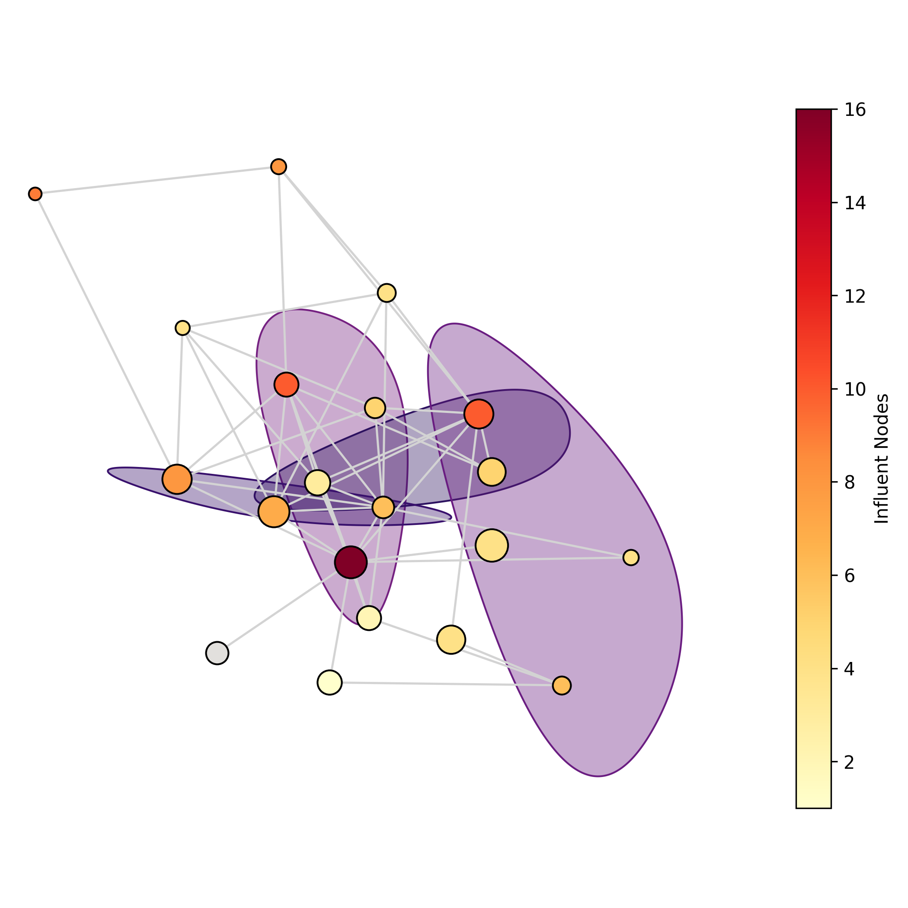

# Influence Maximization in Hypergraphs using Multi-Objective Evolutionary Algorithms

[CODE WILL BE AVAILABLE SOON]

The goal of influence maximization (IM) is to reach the maximum number of entities in a network, starting from a small set of seed nodes, and assuming a model for information propagation. While this task has been widely studied in ordinary graph networks, IM in hypergraphs (where hyperedges represent interactions among more than two nodes) has not been adequately explored yet. The purpose of this study is to propose a multi-objective evolutionary algorithm to tackle the IM problem in hypergraph networks.

<p align="center">

</p>

## Requirements
Before getting started, make sure you have installed all the requirements.
```
pip install -r requirements.txt
```

## Structure
The repository is structured as follows:
```
    .
    ├── data                            # Hypergraphs dataset
    ├── src
        ├── ea                          # Files implementing the inspyred functions (evaluator, mutator, ...)
        ├── greedy                      # Implementation of the high-degree baseline
        ├── random                      # Implementation of the random baseline
        ├── hdd                         # Implementation of the HDD baseline
        ├── smart_initialization.py     # Code for generating the initial population as described in the paper
        ├── moea.py                     # Source code HN-MOEA
        ├── main.py                     # Code main file
        └── monte_carlo_max_hop.py      # Propagation models
```

## External libraries and codes
### HyperGraphX Python Library
In this implementation in order to represent and handle hypergraphs we use the library **HGX**.
- GitHub: [https://github.com/HGX-Team/hypergraphx.git](https://github.com/HGX-Team/hypergraphx.git)
- Paper:  [https://github.com/HGX-Team/hypergraphx.git](https://github.com/HGX-Team/hypergraphx.git)
### HCI-TM-algorithm
The code of HCI-1 and HCI-2 baseline algorithms analyzed in the paper have been taken from the GitHub repository made available by the original authors.
- GitHub: [https://github.com/QDragon18/Influence-Maximization-based-on-Threshold-Model-in-Hypergraphs.git](https://github.com/QDragon18/Influence-Maximization-based-on-Threshold-Model-in-Hypergraphs.git)
- Paper:  [https://doi.org/10.1063/5.0178329](https://doi.org/10.1063/5.0178329)

## Contribution
Authors:
- Stefano Genetti, MSc Student University of Trento (Italy), stefano.genetti@studenti.unitn.it
- Eros Ribaga, MSc Student University of Trento (Italy), eros.ribaga@studenti.unitn.it
- Elia Cunegatti, Ph.D Student University of Trento (Italy), elia.cunegatti@unitn.it
- Quintino Francesco Lotito, Ph.D Student University of Trento (Italy), quintino.lotito@unitn.it
- Alberto Montresor, Full Professor University of Trento (Italy), alberto.montresor@unitn.it
- Giovanni Iacca, Associate Professor University of Trento (Italy), giovanni.iacca@unitn.it

For every type of doubts/questions about the repository please do not hesitate to contact us.
